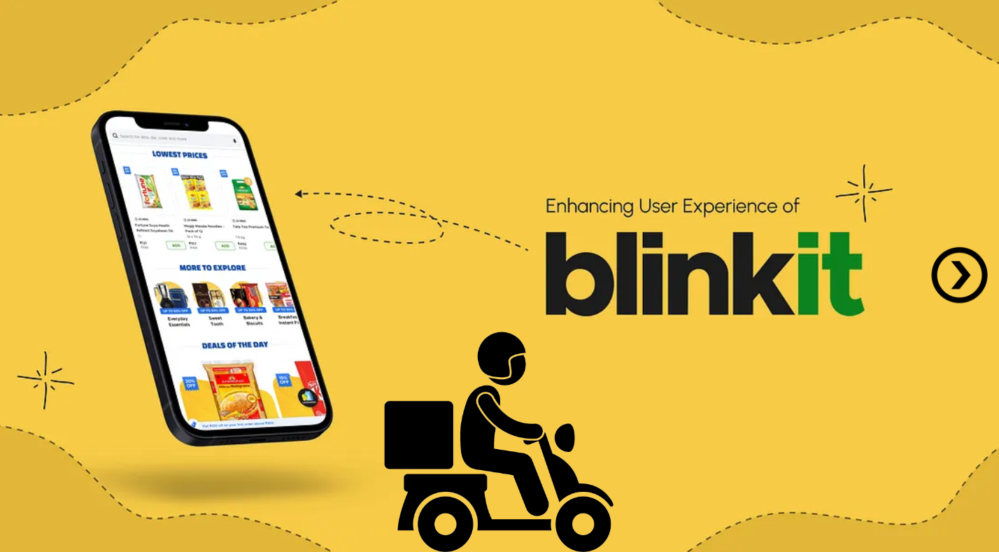
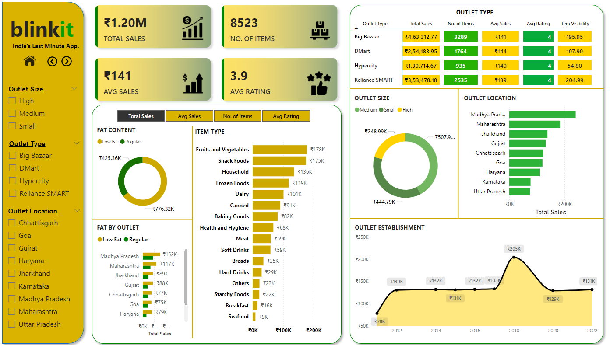
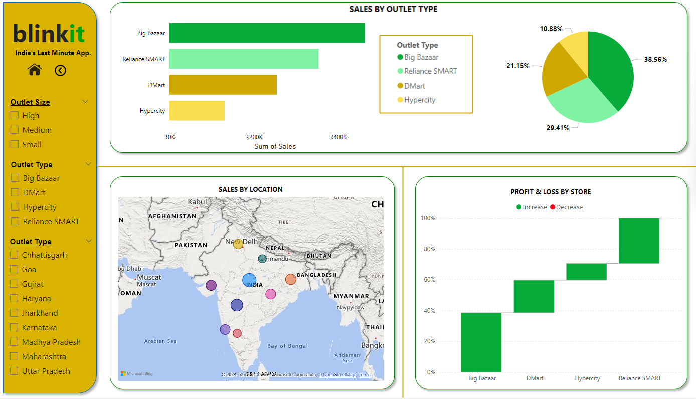

Here’s a sample **README.md** file for your project:

---

# **BlinkIT Grocery Data Dashboard**

## **Project Overview**
This project provides insights into grocery data using **Power BI**, focusing on:
- **Sales trends**
- **Customer behavior**
- **Order distribution**

The analysis demonstrates key **Power BI features** and advanced **data visualization techniques** to uncover actionable insights.

---

## **Key Features**
1. **Interactive Dashboard**: Dynamic visualizations for a user-friendly experience.
2. **Sales Analysis**:
   - Identify peak sales periods.
   - Highlight top-selling products.
3. **Customer Insights**:
   - Analyze purchasing patterns.
   - Segment customers based on behavior.
4. **Order Distribution**:
   - Geographic breakdown of orders.
   - Visualize distribution trends.

---

## **Tools Used**
- **Power BI**: For dashboard creation and data analysis.
- **Excel**: To preprocess and clean the data.
- **SQL**: For querying and organizing datasets.

---

## **Objectives**
1. To understand sales trends and their driving factors.
2. To analyze customer purchasing patterns for targeted marketing.
3. To showcase proficiency in Power BI and storytelling through data visualization.

---

## **Getting Started**
1. Download the Power BI file (`BlinkIT_Grocery_Dashboard.pbix`).
2. Open the file in Power BI Desktop.
3. Explore the interactive visuals and insights.

---

## **Screenshots**
*Include some high-quality screenshots of your dashboard here to visually demonstrate your work.*

### **Overall Dashboard**

### **Sales Trends Visualization**

### **Customer Insights**

---

## **Conclusion**
This dashboard highlights the power of **data-driven decision-making** by providing clear, actionable insights into grocery sales and customer behavior. It's a step forward in optimizing business strategies using data visualization.

---
### **Contact Information**

Feel free to connect or reach out for any queries or collaborations:

- **LinkedIn**: (https://www.linkedin.com/in/manish-sharma-b86aa1195)  
- **Email**: [manish.kota2000.com](manish.kota2000.com)
